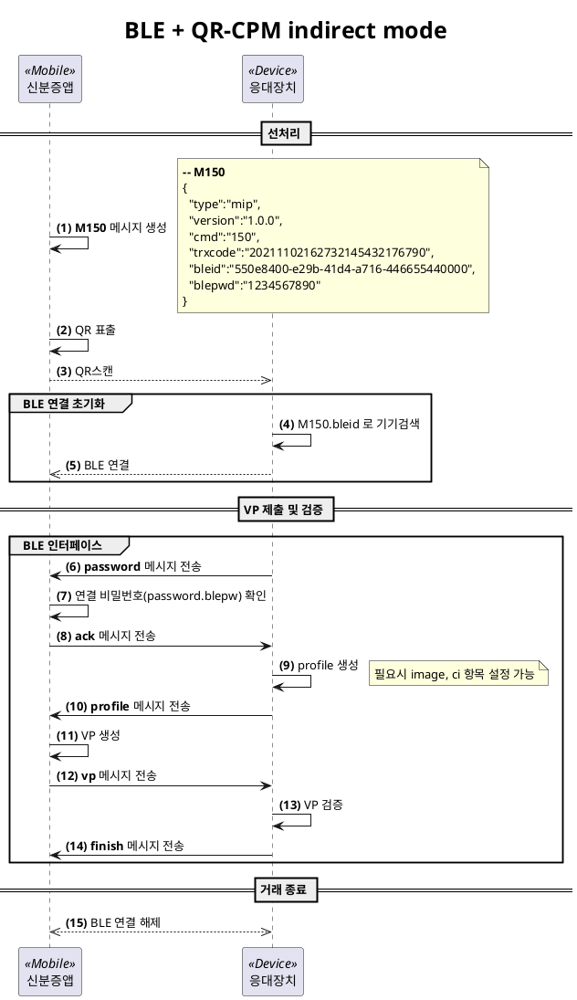

##### 2.2.2.4.3. BLE + QR-CPM indirect mode
[절차 요약]
1. 신분증앱이 `bleid`, `blepw` 생성하여 QR 표출하고 연결 대기
    * bleid: UUID 형식으로 매번 다른 값을 생성
    * blepd: 10자리의 hexa-decimal 스트링
2. 응대장치가 QR을 스캔하여 정보획득
3. 응대장치가 `bleid`로 장치 스캔하여 연결
4. BLE 인터페이스 메시지 형식에 맞게 메시지 송수신
5. 거래 종료

[절차 상세]

