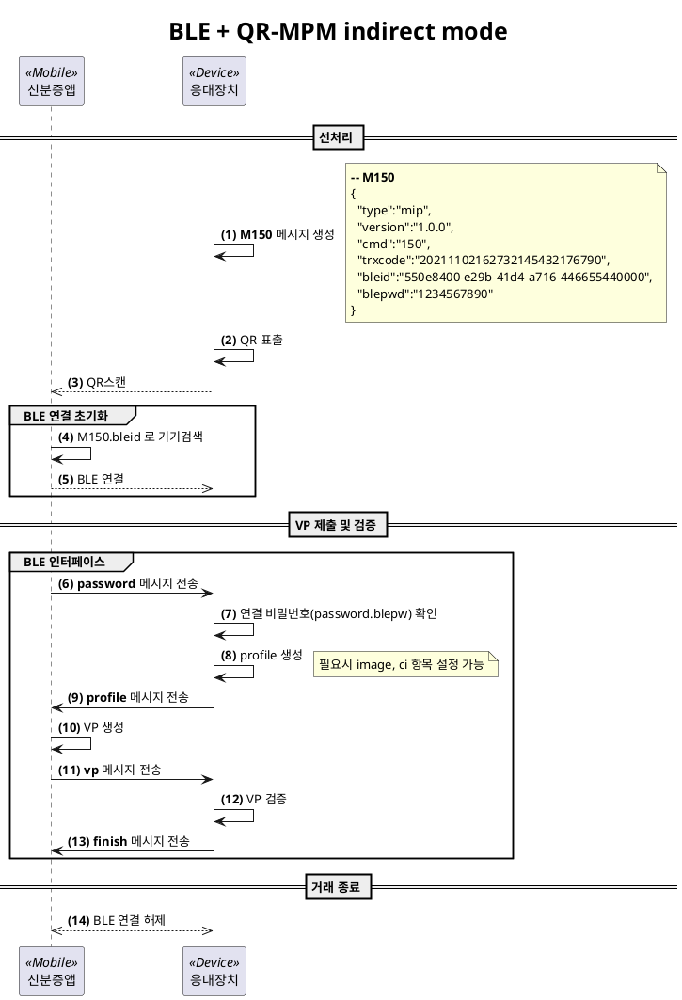
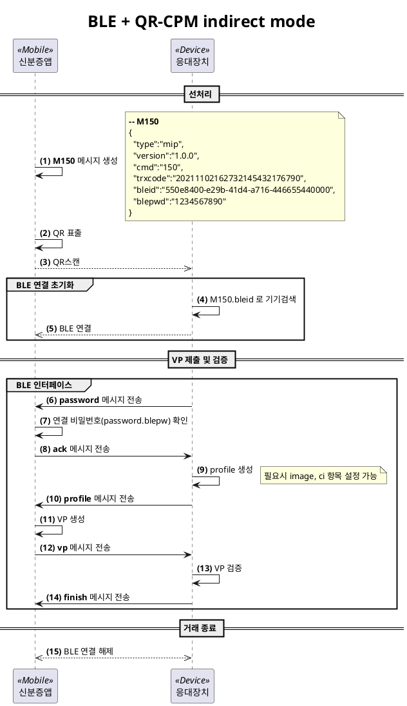

# 2. 메시지 규격

전송모드의 단계별 송수신 메시지의 규격을 정의한다. 본 문서의 모든 메시지는 JSON 형태로 되어 있으며 전송 시 base64 형태로 인코딩한다.

모든 메시지는 아래의 항목을 필수로 포함한다.
* type(M): 'mip'로 고정 (mip = mobile id platform)
* version(M): '1.0.0'으로 고정하고 메시지규격 변경시 버전관리를 통해 하위호환을 보장
* cmd(M): 메시지 고유번호
* trxcode(M): verifier와 신분증앱간 트랜잭션 관리용 코드

※ (M) 표시는 필수항목, (O) 표시는 선택항목

메시지는 크게 다음의 네 가지로 분류한다.

|        단계         |                                         설명                                          |
| ------------------ | ------------------------------------------------------------------------------------ |
| VP 전처리 단계(100) | QR-CPM, QR기반 BLE 등 신분증앱에 직접적으로 VP 요청이 불가한 경우 전처리 요청 메시지를 전송 |
| VP 요청 단계(200)   | VP 제출을 요청하는 단계<br>Profile, BI 이미지 정보 포함 여부는 옵션                       |
| VP 준비 단계(300)   | VP 요청 메시지를 수신 후 필요한 경우 Profile이나 BI 이미지를 수신하는 단계                 |
| VP 제출 단계(400)   | 신분증앱이 verifier에게 VP를 제출하는 단계                                              |
| --- 기타 ---        |                                                                                      |
| 기타 (900)          | 에러 등 단계에 관계없이 전달하는 메시지                                                  |

<span style="color:red">중계서버와의 프로파일, VP 등에 대한 송수신 메시지 규격은 중계서버용 API 매뉴얼을 참고</span>

## 2.1. 100 - VP 전처리 단계

### 2.1.1. [M120] QR-CPM용 전처리 요청 메시지

신분증앱이 중계서버에 거래시작을 요청하고 거래코드를 수신한다. 신분증앱은 M120 메시지를 생성하여 base64 인코딩한 값을 QR로 표시한다.

```json
{
  "type":"mip",
  "version":"1.0.0",
  "cmd":"120",
  "trxcode":"20211102162732145432176790",
  "mode":"proxy",
  "host":"wss://proxy.com:9090"
}
```

[항목]
* trxcode(M)
    * verifier와 신분증앱간 트랜잭션 관리를 위해 중계서버가 생성한 코드로 유일값을 보장해야 함
* mode(M)
    * 'proxy': QR-CPM은 중계서버 모드만 가능
* host(M)
    * Profile 및 VP를 송수신할 중계서버의 호스트명
    * 호스트명 이후의 하위경로는 다른 메시지의 HTTP 헤더에 명시되어 있음

**Base64**

```
ewogICJ0eXBlIjoibWlwIiwKICAidmVyc2lvbiI6IjEuMC4wIiwKICAiY21kIjoiMTIwIiwKICAidHJ4Y29kZSI6IjIwMjExMTAyMTYyNzMyMTQ1NDMyMTc2NzkwIiwKICAibW9kZSI6InByb3h5IiwKICAiaG9zdCI6IndzczovL3Byb3h5LmNvbTo5MDkwIiwKfQ
```

**QR**


### 2.1.2. [M150] QR기반 BLE용 전처리 요청 메시지

BLE 연결정보를 QR로 교환하는 절차이다. BLE 연결을 대기하는 쪽에서 QR을 생성한다.

```json
{
  "type":"mip",
  "version":"1.0.0",
  "cmd":"150",
  "trxcode":"20211102162732145432176790",
  "bleid":"550e8400-e29b-41d4-a716-446655440000",
  "blepwd":"1234567890"
}
```

[항목]
* trxcode(M)
    * verifier와 신분증앱간 트랜잭션 관리를 위해 BLE advertiser 측이 생성한 코드로 유일값을 보장해야 함
    * QR-CPM의 경우 신분증앱이, QR-MPM인 경우 verifier 측이 생성함
* bleid(M)
    * BLE 연결을 위한 장치 ID
    * 1회용 ID로서 사용후 폐기하고 다른 값을 생성해야 함
* blepwd(M)
    * BLE 연결을 위한 비밀번호
    * 1회용 비밀번호로서 사용후 폐기하고 다른 값을 생성해야 함


## 2.2. 200 - VP 요청 단계

### 2.2.1. [M200] VP 요청 메시지

Verifier가 신분증앱에 VP 제출을 요청하는 메시지이다.

```json
{
  "type":"mip",
  "version":"1.0.0",
  "cmd":"200",
  "trxcode":"20211102162732145432176790",
  "mode":"direct",  -- direct/indriect/proxy
  "profile":"base64 인코딩된 profile",
  "image":"link",
  "ci":false,
  "host":"http://example.com"
}
```

[항목]
* mode(M)
    * 'direct': 신분증앱이 VP를 verifier 서버에 직접 전송
    * 'indirect': 신분증앱으로부터 App2App, BLE 등 간접 인터랙션을 통해 VP를 verifier 서버에 전송
    * 'proxy': verifier 서버와의 직접 통신이 불가하여 중계서버를 이용하는 경우
* profile(O)
    * profile string을 base64 인코딩한 값
    * 항목이 누락된 경우 본 메시지에 profile 항목 미포함. *host*/mip/profile 경로로 profile 요청하여야 함
* image(O)
    * 'link': 본 메시지에 이미지 항목 미포함. *host*/mip/image 경로로 이미지 요청하여야 함
    * 기타: BI 이미지 수신 URL (ex: http://example.com/image/1.jpg)
    * image 항목이 누락되거나 값이 `null`인 경우 이미지를 제공하지 않음
* ci(O)
    * true: VP에 CI를 포함
    * false/null: VP에 CI를 포함하지 않음
* host(O)
    * profile, image 항목을 모두 포함하는 경우 생략 가능
    * 신분증앱에서 profile을 다운로드할 서버의 호스트명
    * 호스트명 이후의 하위경로는 다른 메시지의 HTTP 헤더에 명시되어 있음

### 2.2.2. 인터페이스 별 M200 전송방법

사용하는 인터페이스에 따라 각각 정의된 방식으로 M200 메시지를 신분증앱에 전달한다.

#### 2.2.2.1. QR-MPM

M200 메시지를 base64 인코딩후 QR로 표시한다.

**Base64**

```
ewogICJ0eXBlIjoibWlwIiwKICAidmVyc2lvbiI6IjEuMC4wIiwKICAiY21kIjoiMjAwIiwKICAidHJ4Y29kZSI6IjIwMjExMTAyMTYyNzMyMTQ1NDMyMTc2NzkwIiwKICAibW9kZSI6ImRpcmVjdCIsCiAgInByb2ZpbGUiOiJsaW5rIiwKICAiaW1hZ2UiOiJsaW5rIiwKICAiaG9zdCI6ImV4YW1wbGUuY29tIgp9
```

**QR**


**주의사항**

<span style="color: red">
QR-MPM 적용 시 M200에 profile은 포함하지 않아야 않아야 한다. profile을 포함하면 데이터 용량이 커져 신분증앱이 QR코드를 제대로 인식하지 못하는 상황이 자주 발생한다.
</span>

#### 2.2.2.2. PUSH

서비스 제공자의 웹 페이지에서 사용자의 전화번호를 입력받아 VP 제출을 요청하는 경우 VP 요청 메시지(M200)는 PUSH 메시지에 담아서 보내야 한다. verifier는 전화번호와 VP 요청 메시지를 아래의 `PUSH 요청 메시지`에 담아 한국조페공사 PUSH 서버에 전송한다.

**PUSH 요청 메시지**

```json
{
  "mscode":"************",
  "pushType":"MIP-USP-001",
  "name":"홍길동",
  "birth":"20010801",
  "telno":"01012345678",
  "data":"ew0KICAidHlwZSI6ICJtaXAiLA0KICAiY21kIjogIjIwMCIsDQogICJ2ZXJzaW9uIjogIjEuMC4wIiwNCiAgInRyeGNvZGUiOiAiMjAyMjAxMjQxODEwNDQ5ODNBQ0MwNTNEMSIsDQogICJtb2RlIjogImRpcmVjdCIsDQogICJpbWFnZSI6ICJsaW5rIiwNCiAgImNpIjogdHJ1ZSwNCiAgImhvc3QiOiAiaHR0cDovL3d3dy55b3Vyc2VydmljZS5jb20iDQp9"
}
```

[항목]
* mscode(M)
    * 검증자 등록시 한국조폐공사에서 발급하는 코드
* pushType(M)
    * PUSH 메시지 타입
    * 'MIP-USP-001'로 고정
* name(O)
    * PUSH 메시지 수신자 성명
* birth(O)
    * PUSH 메시지 수신자 생년월일(YYYYMMDD)
* telno(M)
    * PUSH 메시지를 수신할 전화번호
* data(M)
    * VP 요청 메시지(M200)를 base64 인코딩한 값
    * PUSH 메시지 payload 사이즈 제한으로 아래 사항을 권고함
        * M200.host: (필수) SP서버의 주소
        * M200.profile: 미포함
        * M200.image: "link" 또는 미포함

[PUSH용 M200 예시]

```json
{
  "type": "mip",
  "cmd": "200",
  "version": "1.0.0",
  "trxcode": "20220124181044983ACC053D1",
  "mode": "direct",
  "image": "link",
  "ci": true,
  "host": "http://www.yourservice.com"
}

-- profile 항목이 없음에 유의 => 신분증앱은 http://www.yourservice.com/mip/profile 주소로 M310 메시지 송신하여 profile 획득함
```


**HTTP Request**
PUSH 서버에 전송 시는 해당 메시지를 base64 인코딩해서 전달한다.

* 조폐공사 PUSH 서버 URL: `https://psh.mobileid.go.kr:8443/api/sendVPAPI.do`

```http
POST /api/sendVPAPI.do HTTP/1.1
Host:psh.mobileid.go.kr:8443
Content-type:application/json; charset=UTF-8

{
  "data":"base64 인코딩된 PUSH 요청 메시지"   <== base64 padding 적용 필수
}
```

**HTTP Response (정상)**
PUSH 서버는 상기 요청에 대해 정상인 경우 아래와 같이 응답한다.

```http
HTTP/1.1 200
Content-type:application/json; charset=UTF-8

{
  "key":1,
  "result":true,
  "resultMsg":"SUCCESS",
  "errcode":0,
  "errmsg":"success"
}
```

**HTTP Response (오류)**
오류 발생 시 아래와 같이 응답한다.

```http
HTTP/1.1 200
Content-type:application/json; charset=UTF-8

{
  "key":0,
  "result":false,
  "resultMsg":"NOT_ENOUGH_DATA",
  "errcode":10304,
  "errmsg":"data is missing"
}

```

[가능한 오류 목록]

| 오류코드<br>(10진수) |         이름         |          설명           |
| ------------------- | ------------------- | ---------------------- |
| 10301               | mscode is missing   | 미등록 연계시스템        |
| 10302               | pushType is missing | pushType이 작성되지 않음 |
| 10303               | telno is missing    | telno가 작성되지 않음    |
| 10304               | data is missing     | data가 작성되지 않음     |
| 10305               | receive is missing  | 조회된 수신자 없음       |
| 10306               | insert data fail    | 메시지 정보 INSERT 실패  |
| 10399               | unknown error       | 알 수 없는 오류          |


#### 2.2.2.3. App2App

별도의 App2App 연동 가이드 문서를 참조한다.

#### 2.2.2.4. BLE

신분증앱과 응대장치가 물리적으로 가까운 거리에 있고, BLE로 정보를 송수신하는 경우에 대하여 설명한다. 모드는 아래 두 가지가 있다.

|            모드             |                  설명                  |                            장치의 온라인 여부                            |
| -------------------------- | ------------------------------------- | ---------------------------------------------------------------------- |
| BLE + QR-MPM indirect mode | 응대장치가 QR을 표출하고 BLE 연결을 대기 | - 신분증앱: 온라인<br>- 응대장치: 온라인                                  |
| BLE + QR-CPM indirect mode | 신분증앱이 QR을 표출하고 BLE 연결을 대기 | - 신분증앱: <span style="color:red">오프라인</span><br>- 응대장치: 온라인 |

대부분의 상황에서는 신분증앱이 인터넷에 연결된 상태이므로 `BLE + QR-MPM` 방식의 사용을 권장한다.

##### 2.2.2.4.1. 공통
[메시지]

절차 설명에 나타나는 `password`, `profile` 등의 메시지는 **6.1. BLE 인터페이스 메시지**를 참조한다. 중계서버 메시지와 형식은 유사하나 같은 것이 아님을 유의하여야 한다. 이러한 이유로 <u>BLE + QR 모드에서는 M200 메시지는 사용되지 않는다</u>.

[메시지 전송]

각 메시지 전송 시에는 메시지의 끝을 알리기 위한 고유 문자열 "/EOM/"을 첨부한다. 아래는 그 예시이다.

|       신분증앱        |            응대장치            |
| -------------------- | ----------------------------- |
|                      | ← {"msg":"password",...}/EOM/ |
| {"msg":"ack"}/EOM/ → |                               |


[가능한 오류 목록]

오류 발생 시 `error` 메시지에 오류정보를 담아 전송한다.

| 오류코드<br>(10진수) |        이름         |        설명        |         비고          |
| ------------------- | ------------------ | ------------------ | -------------------- |
| 10501               | incorrect password | BLE 비밀번호 불일치 | 응대장치에서 오류 발생 |
| 20501               | incorrect password | BLE 비밀번호 불일치 | 신분증앱에서 오류 발생 |

##### 2.2.2.4.2. BLE + QR-MPM indirect mode

[절차 요약]
1. 응대장치가 `bleid`, `blepw` 생성하여 QR 표출하고 연결 대기
    * bleid: UUID 형식으로 매번 다른 값을 생성
    * blepd: 10자리의 hexa-decimal 스트링
2. 신분증앱이 QR을 스캔하여 정보획득
3. 신분증앱이 `bleid`로 장치 스캔하여 연결
4. BLE 인터페이스 메시지 형식에 맞게 메시지 송수신
5. 거래 종료

[절차 상세]


##### 2.2.2.4.3. BLE + QR-CPM indirect mode
[절차 요약]
1. 신분증앱이 `bleid`, `blepw` 생성하여 QR 표출하고 연결 대기
    * bleid: UUID 형식으로 매번 다른 값을 생성
    * blepd: 10자리의 hexa-decimal 스트링
2. 응대장치가 QR을 스캔하여 정보획득
3. 응대장치가 `bleid`로 장치 스캔하여 연결
4. BLE 인터페이스 메시지 형식에 맞게 메시지 송수신
5. 거래 종료

[절차 상세]



#### 2.2.2.5. NFC

<span style="color:red">정의 필요</span>


## 2.3. 300 - VP 준비 단계

### 2.3.1. [M310] Profile 요청 메시지

신분증앱은 VP 요청 메시지(M200)를 참조해서 profile URL로부터 프로파일을 다운로드하기 위해 아래와 같이 메시지를 구성한다.

```json
{
  "type":"mip",
  "version":"1.0.0",
  "cmd":"310",
  "request":"profile",
  "trxcode":"20211102162732145432176790"
}
```

[항목]
* request(M)
    * 'profile' 고정

**HTTP Request**
verifier에 요청 시는 해당 메시지를 base64 인코딩해서 전달한다.
```http
POST /mip/profile HTTP/1.1
Host:http://example.com
Content-type:application/json; charset=UTF-8

{
  "data":"base64 인코딩된 프로파일 요청메시지"
}
```

**HTTP Response (정상)**
검증자는 상기 요청에 대해 아래와 같이 응답 메시지를 구성한다.

```json
{
  "trxcode":"20211102162732145432176790",
  "profile":"base64 인코딩된 profile"
}
```

http 응답코드와 함께 base64 인코딩된 메시지를 응답한다.
```http
HTTP/1.1 200
Content-type:application/json; charset=UTF-8

{
  "result":true,
  "data":"base64 인코딩된 프로파일 응답메시지"
}
```

**HTTP Response (오류)**
오류 발생 시 아래와 같이 오류 메시지를 구성한다.

```json
{
  "type":"mip",
  "version":"1.0.0",
  "cmd":"900",
  "trxcode":"20211102162732145432176790",
  "errcode":"10002",
  "errmsg":"missing mandatory item: request"
}
```

http 응답코드와 함께 base64 인코딩된 오류 메시지를 응답한다.
```http
HTTP/1.1 200
Content-type:application/json; charset=UTF-8

{
  "result":false,
  "data":"base64 인코딩된 오류 메시지"
}
```

[가능한 오류 목록]

| 오류코드<br>(10진수) |             이름             |                   설명                    |
| ------------------- | --------------------------- | ----------------------------------------- |
| 10001               | unexpected message format   | JSON 형식의 메시지가 아님                   |
| 10002               | missing mandatory item      | type, version, cmd, request, trxcode 누락 |
| **--- 데이터 ---**  |                             |                                           |
| 10100               | invalid data                | request != 'profile'                      |
| 10101               | invalid type                | type != 'mip'                             |
| 10102               | unsupported message version | 지원하지 않는 메시지 버전                   |
| 10103               | invalid cmd                 | cmd != '310'                              |
| 10104               | trxcode not found           | 존재하지 않는 거래코드                      |
| **--- 절차 ---**    |                             |                                           |
| 10202               | timeout error               | 유효시간 초과 오류                          |
| **--- 기타 ---**    |                             |                                           |
| 99999               | unknown error               | 알 수 없는 오류                            |


**샘플 profile (일반 VP 제출용. presentType=1)**
데이터는 실제와 무관하므로 JSON 형태의 항목만 참조한다.

```json
{
    "encoding": "UTF-8",
    "id": "did:omn:2DsCWzaAnhXeRNDkKWJdE2oypRRB",
    "language": "KR",
    "profile": {
        "authType": [
            "pin"
        ],
        "callBackUrl": "http://example.com/mip/vp",
        "encryptType": 2,
        "filter": {
            "allowIssuerList": [
            ],
            "requiredAssertionList": [
                {
                    "id": "driverlicen",
                    "name": "운전면허증",
                    "type": "driverlicen"
                },
                {
                    "id": "stk",
                    "name": "stk",
                    "type": "stk"
                }
            ],
            "requiredPrivacyList": [
                "address"
            ]
        },
        "keyType": 2,
        "name": "Raonsecure",
        "nonce": "2704b5e4eb5de74c3ff7956c53ae1dc9596a89545fe581755bee82995f7a83a2",
        "presentType": 1,
        "publicKey": "2TuPVgMCHJy5atawrsADEzjP7MCVbyyCA89UW6Wvjp9HrAjbJ1SzHsuJBqBShz1UoKVXLcKgoa4ACC5S579PUQpxFNPfVC3sRcMmeF7N5gPshhr2D7THUxsN6fo8U5Efjp24p8RUiyDS7QrV1W2DTSgFtPtfq2M8FRXFaPDJ2LDDuqDbAdaKdqkgobRBbQeW9B96WT9EGamGA8JYUSfPyw7V2c9gKcMGVisXEEqJFCM4uUpBS7yDXquKyT2EFfoxCRKNTT64FhP3rkLGsSizZhrBYxyuTdcVbnrpVoAgHNPGjTUzcYJ3CAtNGDPggUyeUwZ3Lq1tA9AbUCmHEmBU9dSFeDsxBF3kzTSLW1a3BPR4knK6ZGuUagzL8tYGQ1daoc2yh2mPuCDVjarYHE",
        "spCode": "omni.sp2",
        "svcCode": "zkph2",
        "type": "VERIFY"
    },
    "proof": {
        "created": "2021-11-08T15:52:45",
        "creator": "did:omn:2DsCWzaAnhXeRNDkKWJdE2oypRRB#zkph2",
        "nonce": "7a5ab53fbc208576783248c872a7662c9304bf4dcb331d892c12c9f56b3d1d0f",
        "signatureValue": "3rxczYCHDEpjS4CUWiZwZDt7fznCYcW5Y5mbFgcwWJE2utEbFqDkWCSZPSemoLtpvz1FTvyS2QzEXy9rRZ6Njxifn",
        "type": "Secp256k1VerificationKey2018"
    },
    "timezone": "UTC+9",
    "version": "3.0"
}
```


### 2.3.2. [M320] Image 요청 메시지

신분증앱은 VP 요청 메시지(M200)를 참조해서 이미지 URL로부터 이미지를 다운로드하기 위해 아래와 같이 이미지 요청 메시지를 구성한다.

```json
{
  "type":"mip",
  "version":"1.0.0",
  "cmd":"320",
  "request":"image",
  "trxcode":"20211102162732145432176790"
}
```

[항목]
* request(M)
    * 'image'로 고정

**HTTP Request**
verifier에게 요청시는 해당 메시지를 base64 인코딩해서 전달한다.
```http
POST /mip/image HTTP/1.1
Host:http://example.com
Content-type:application/json; charset=UTF-8

{
  "data":"base64 인코딩된 이미지 요청메시지"
}
```

**HTTP Response (정상)**
http 응답코드와 함께 base64 인코딩된 메시지를 응답한다.
```http
HTTP/1.1 200
Content-type:application/json; charset=UTF-8

{
  "result":true,
  "data":"base64 인코딩된 이미지 응답메시지"
}
```

**HTTP Response (오류)**
오류 발생 시 아래와 같이 오류 메시지를 구성한다.

```json
{
  "type":"mip",
  "version":"1.0.0",
  "cmd":"900",
  "trxcode":"20211102162732145432176790",
  "errcode":10002,
  "errmsg":"missing mandatory item: request"
}
```

http 응답코드와 함께 base64 인코딩된 오류 메시지를 응답한다.
```http
HTTP/1.1 200
Content-type:application/json; charset=UTF-8

{
  "result":false,
  "data":"base64 인코딩된 오류 메시지"
}
```

[가능한 오류 목록]

| 오류코드<br>(10진수) |             이름             |                   설명                    |
| ------------------- | --------------------------- | ----------------------------------------- |
| 10001               | unexpected message format   | JSON 형식의 메시지가 아님                   |
| 10002               | missing mandatory item      | type, version, cmd, request, trxcode 누락 |
| **--- 데이터 ---**  |                             |                                           |
| 10100               | invalid data                | request != 'image'                        |
| 10101               | invalid type                | type != 'mip'                             |
| 10102               | unsupported message version | 지원하지 않는 메시지 버전                   |
| 10103               | invalid cmd                 | cmd != '320'                              |
| 10104               | trxcode not found           | 존재하지 않는 거래코드                      |
| **--- 절차 ---**    |                             |                                           |
| 10202               | timeout error               | 유효시간 초과 오류                          |
| **--- 기타 ---**    |                             |                                           |
| 99999               | unknown error               | 알 수 없는 오류                            |


## 2.4. 400 - VP 제출 단계


### 2.4.1. [M400] VP 제출 메시지

신분증앱은 프로파일을 참조해서 아래와 같이 VP 제출 메시지를 생성한다.

M400 메시지 제출 URL
* 1순위: 수신한 profile의 `profile.callBackUrl`에 지정한 URL
* 2순위: M200 메시지의 `host`에 지정된 호스트의 /mip/vp 경로 (*host*/mip/vp)

```json
{
  "type":"mip",
  "version":"1.0.0",
  "cmd":"400",
  "request":"presentation",
  "trxcode":"20211102162732145432176790",
  "vp":{...}
}
```

[항목]
* request(M)
    * 'presentation'으로 고정
* trxcode(M)
    * 전처리 요청 메시지(M1XX) 또는 VP 요청 메시지(M200) 내에 지정된 trxcode
* vp(M)
    * presentType(M): 제출타입으로 profile 내의 `presentType`을 그대로 설정
        * 0: DID Auth
        * 1: DID VP
        * 2: ZKP(영지식증명) VP
    * encryptType(M): VP 암호화 여부 및 암호화 알고리즘
        * 0: 암호화 하지 않음
        * 1: AES-128
        * **2: AES-256** (mDL은 VP를 AES-256으로 암호화하며, 암호화에 쓰인 키를 서버의 공개키로 암호화 함)
    * keyType(M): 암호화 시 키 종류
        * 0: secp256k1
        * 1: secp256r1
        * **2: RSA**
    * authType(O): 인증방식
        * profile 내의 `authType`을 그대로 설정
        * presentType = 2일 때 생략
    * did(O): holder의 DID
        * presentType = 2일 때 생략
    * nonce(O): Profile의 nonce
        * presentType = 1일 때만 필수
    * zkpNonce(O): ZKP Profile의 nonce
        * presentType = 2일 때만 필수
    * type(M)
        * 'VERIFY'로 고정
    * data(M)
        * VP를 암호화하여 hexstring 인코딩한 값

[예시 1 - DID VP]
```json
{
  ...
  "vp": {
    "presentType": 1,
    "encryptType": 2,
    "keyType": 2,
    "authType":["pin"],
    "did": "did:omn:3WaMJYY4KeNsHmwH6G2Hmx8H9a74",
    "nonce": "2704b5e4eb5de74c3ff7956c53ae1dc9596a89545fe581755bee82995f7a83a2",
    "type": "VERIFY",
    "data": "01005666dd8098f6f825...c2b7"
  }
}
```

[예시 2 - ZKP(영지식증명) VP]
```json
{
  ...
  "vp": {
    "presentType": 2,
    "encryptType": 2,
    "keyType": 2,
    "zkpNonce": "96e0eaf9cdde350f0be124db726ec7175b81741761a1722a1c50d74eaaec2008",
    "type": "VERIFY",
    "data": "01005666dd8098f6f825...c2b7"
  }
}
```

**HTTP Request**
verifier에게 제출시는 해당 VP 제출메시지를 base64 인코딩해서 아래와 같이 전달한다.

```http
POST /mip/vp HTTP/1.1
Host:http://example.com
Content-type:application/json; charset=UTF-8

{
  "data":"base64 인코딩된 이미지 요청메시지"
}
```

**HTTP Response (정상)**
아래와 같이 응답한다.
```http
HTTP/1.1 200
Content-type:application/json; charset=UTF-8

{
  "result":true
}
```

**HTTP Response (오류)**
오류 발생 시 아래와 같이 오류 메시지를 구성한다.

```json
{
  "type":"mip",
  "version":"1.0.0",
  "cmd":"900",
  "trxcode":"20211102162732145432176790",
  "errcode":10002,
  "errmsg":"missing mandatory item: request"
}
```

http 응답코드와 함께 base64 인코딩된 오류 메시지를 응답한다.
```http
HTTP/1.1 200
Content-type:application/json; charset=UTF-8

{
  "result":false,
  "data":"base64 인코딩된 오류 메시지"
}
```

[가능한 오류 목록]

| 오류코드<br>10진수  |             이름             |                               설명                               |
| ------------------ | --------------------------- | --------------------------------------------------------------- |
| 10001              | unexpected message format   | JSON 형식의 메시지가 아님                                         |
| 10002              | missing mandatory item      | type, version, cmd, request, trxcode, vp 및 vp 하위 필수항목 누락 |
| **--- 데이터 ---** |                             |                                                                 |
| 10100              | invalid data                | - request != 'presentation'<br>- vp.presentType != [0,1,2] 등    |
| 10101              | invalid type                | type != 'mip'                                                   |
| 10102              | unsupported message version | 지원하지 않는 메시지 버전                                          |
| 10103              | invalid cmd                 | cmd != '400'                                                    |
| 10104              | trxcode not found           | 존재하지 않는 거래코드                                             |
| **--- 절차 ---**   |                             |                                                                 |
| 10201              | message sequence error      | 선행 M310 송수신 필요                                             |
| 10202              | timeout error               | 유효시간 초과 오류                                                |
| **--- 기타 ---**   |                             |                                                                 |
| 99999              | unknown error               | 알 수 없는 오류                                                   |


## 2.5. 900 - 기타

### 2.5.1. [M900] 오류 메시지

오류 메시지는 다음 두 가지의 경우에 사용된다.

1. verifier가 신분증앱에 오류 응답
2. 신분증앱이 verifier에 오류 응답


```json
{
  "type":"mip",
  "version":"1.0.0",
  "cmd":"900",
  "trxcode":"20211102162732145432176790",
  "errcode":10002,
  "errmsg":"missing mandatory item: request"
}
```

[항목]
* errcode(M): 오류 코드
    * 오류 코드표 참조
* errmsg(M): 오류 메시지
    * 오류 코드표 참조


#### 2.5.1.1. verifier가 신분증앱에 오류 응답

http 응답의 data 항목에 오류 메시지를 base64로 인코딩하여 다음과 같이 응답한다.

```http
HTTP/1.1 200
Content-type:application/json; charset=UTF-8

{
    "result":false,
    "data":"base64 인코딩된 오류 메시지"
}
```

#### 2.5.1.2. 신분증앱이 verifier에 오류 응답

**HTTP Request**
verifier에게 오류 전달 시 해당 메시지를 base64 인코딩해서 전달한다.

```http
POST /mip/error HTTP/1.1
Host:http://example.com
Content-type:application/json; charset=UTF-8

{
  "data":"base64 인코딩된 오류 메시지"
}
```

**HTTP Response**
verifier는 신분증앱으로부터 오류 메시지 수신 시 적절한 오류 처리 후 아래와 같은 메시지를 응답한다. 응답 후 verifier는 해당 거래코드의 세션을 종료한다. 신분증앱은 송신한 오류 메시지에 대한 verifier의 응답 여부 및 결과코드에 관계없이 해당 거래코드의 세션을 종료한다.

```http
HTTP/1.1 200
Content-type:application/json; charset=UTF-8

{
  "result":true
}
```

